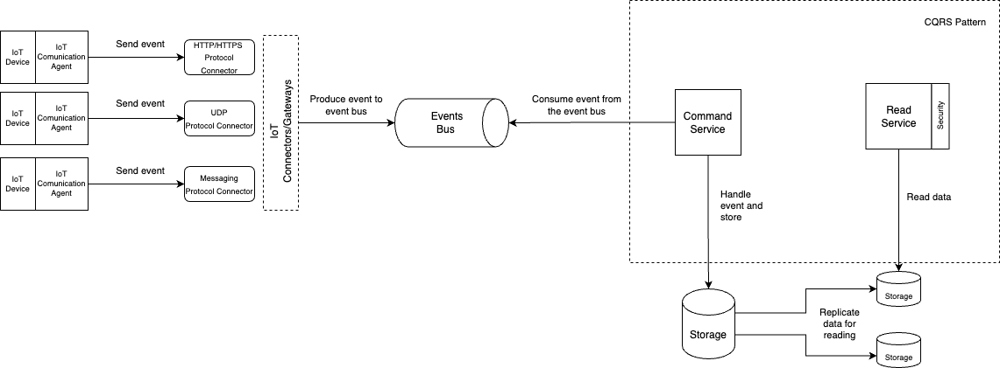
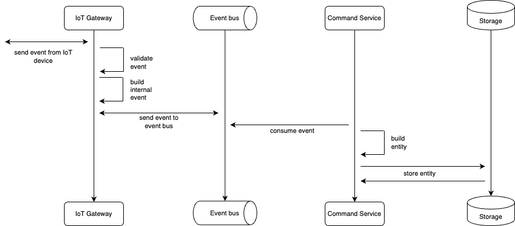

# IoT Devices events handler
## Domain:
IoT Devices/ sensors (FI thermostat, heart rate, car fuel etc.)
## Input sensor event data:
* event time (milliseconds)
* sensor type (string without spaces)
* value (measurement value)
## Technical requirements:
### General requirements:
* Scalable and extendable to work with more IoT devices.
* Scalable itself. Each system component MUST have an ability to scale under the load.
* Fault tolerance.
* Independence from any specific platform (can be cloud, datacenters etc.)
* Possibility of aggregation events per conditions.
### IoT Sensors requirements:
* can have different event channels (HTTP/HTTPS, UDP,  Message Brokers etc.)
* different amount events per sec
* can have not specified sensor types
### Event storage requirements:
* high load on inserting operations
* doing aggregation per condition operation
* fault tolerance
* real-time results is not required 
### Event bus requirements:
* continuous data
* fault tolerance
* scalability
* fast processing
## System architecture high level design
  
  IoT devices (out of scope):
  sensors who produces events in time

#### IoT Communication Agent (out of scope):
A system which helps in providing communication between sensor and other world
#### IoT Connectors/Gateways:
A system which provides a bus for transporting IoT devices events directly to the system
can provide an ability to validate security
has separate connector per communication protocol
#### Event bus:
Channel which helps to transport IoT devices events through the system for further manipulations.
#### Command service:
Sub-system is responsible for consuming IoT devices events, doing preparations and storing directly to storage
#### Read service:
Sub-system is responsible for requesting and aggregating stored data per conditions
#### Security:
Security layer is responsible for validating the access to data for a specific user
## Sequence diagram for event processing


## Solution Technical stack
### IoT Connectors/Gateways:
The system needs a lightweight service with a fast lifecycle (startup time + shutdown time).
The aim of the service is to receive the event and pass it to the internal event bus.

There are several options:
* Cloud native functions (like lambda-function for AWS and google-function for GCP):
    - really lightweight
    - fast startup and shutdown time
    - easy to scale
    - easy to add an extra functionality
* On-demand approach. The aim is the same however it must work on each platform in the same way. 

    JVM world has several excellent frameworks for that:
    - __spring-boot__. It is a good solution with a lot of ready-to-use starters however it is quite heavy for lightway operation like that.
    - __quarkus__. It is quite a new framework which is based on the microProfile ecosystem. It is really fast and convenient for operations like that. If quarkus is built as a native image then the startup time can x15 better than spring-boot have. Also the artifact has less size that spring-boot.

I would choose a quarkus framework for that service because of advantages which are mentioned before.

### Event bus:
The system needs a system which can meet the requirements which were mentioned above.

There are several general approaches for handling continuous data:
* message brokers (like RabbitMQ, ActiveMQ, Kafka, AWS SQS etc.)
* message streaming systems(like Flink, Apache Beam, Kafka Streams, AWS Kinesis etc.)

I would choose Apache Kafka. It supports a classic Producer/Consumer pattern and data streams as well. 

The system can be run based on Producer/Consumer pattern. It will be much cheaper (money, complexity, support, time) approach for the beginning.

Kafka is message broker which has a lot of advantages. There the most powerful:
* Kafka is a log, your writes are appended to the tail, but you read from where you want.
* Kafka is truly distributed - data is sharded , replicated, durability guarantees can be tuned, availability can be tuned. rabbitmq has limited support for the above.
* Kafka also comes with OOB with consumer frameworks which allow distributed processing of the log reliably. Kafka streams also have stream processing semantics built into it.
* Kafka is extensible in the consumer model, allowing you to build exactly once, at most once , at least once.
* system can relay on scalability and reliability of kafka:
* Each topic can be scaled with partitions and more consumers can handle messages.
kafka has a mechanism to do a data dump to a storage and if it fails it would startup the dump.
* Producer/Consumer model can be used for handling tons of IoT devices events
supports event streaming.

### Storage 
The system should have an ability to store continuous data (time-series data) properly. Data storage should provide:
* accessibility
* scalability
* fault tolerance
__One way__ is having 2 separate data storages: rdmsm for metadata(mysql, postgresql) and noSql storage for data. This approach adds complexity to the system because running a polyglot database architecture adds operational and application complexity.
__Another way__ is using the time-series databases which provide all needed operations for data managing.

### Event data management
IoT devices events should be handled and stored to some database for further reporting manipulation. We can see the biggest load will be to a storing events part. It can be changed during the time when users would need to get a lot of reports for data.
Here we can see different loads for 2 major operations: WRITE and READ. I would use a CQRS pattern for solving this issue. This pattern specifies splitting the WRITE and READ operation to domain into separate processes: COMMAND and QUERY. 
The system can scale a specific type of operations scope.

There are quite a lot of time-series database solutions, like:
* influencDB
* TimescaleDB (PostgreSQL based)
* kudu
* MongoDB

The most reasonable is TimescaleDB. 
It is based on PostgreSQl and supports all RDBMS features for building reports. 
It achieves good performance because it is automatically partitioning data across time and space behind the scenes, 
while presenting the illusion of a single, continuous table (called a “hypertable”) across all partitions to the user.

#### Command service:
The system should have a service with fast startup. It helps with scaling in the future. There should be a mechanism which can cover a reprocessing action (here can help kafka policies at least once + when the system commits a message offset to message broker).
Technical stack:
- spring-boot OR quarkus
- spring data OR jdbc
- kafka cli
- actuator + metrics propagator (micrometer)

#### Read (Query by CQRS) service:
The system should have a service which can handle heavy aggregation requests. It should be scalable for cases when there are a lot of users who want to get reports. Also the service must be secured and a specific user should have an ability to request data. Service should provide a specified API for consuming aggregated  data.

Technical stack:
* spring-boot
* spring data OR spring-jdbc OR JOOQ
* actuator + metrics propagator


### Config service:
The system should consume all required configuration properties (like db host, credentials etc.) from a specific config management system per each environment
There are several already existed frameworks which can provide this ability to the system, like:
* spring-cloud config service
* consul
* kubernetes configMap
* AWS Secrets
* Netfix Archaius

I would rather use solution which is already existed under production infrastructure (like configMap), 
because it is part of infrastructure and supporting will be much easier and cheaper

### Security:
The system should have an ability to verify an user who wants to get reports from the system. 

The most convenient approach is to use an OAuth2 framework + Spring Security. It has a separate security-service which can verify a user account and grant him specific permissions.

# TO DO Improvements
* Cover services with Dockerfile and deploy to the docker management platform
* Move eventbus codebase to a separate lib which can be used independently for each IoT Gateway agent
* Create a separate workflow for fulfilling the sensors dictionary
* Create a separate implementation based on data streaming platform
* Integration test coverage

# How To Run the project
## System requirements
* docker must be installed
* java 17 should be installed
## Running steps
* go to project folder and run maven build project command
````
cd iot-pipeline & mvn clean package
````
* go to docker folder and run the command
````
cd docker & docker compose up
````
* run java spring-boot service processes
````
java -jar __service-folder__/target/__service-name__-1.0-SNAPSHOT.jar
````
Each service has own port:
* api-gateway-service - 8082
* sensor-command-service - 8083
* sensor-query-service - 8084

## Api using
* Sensors data can be put via API:
````
POST http://localhost:8082/iot/api/event
{
    "sensor": "hearrate_Zk8NGiLi8L",
    "time": "1667150394000",
    "measurement": 75
}
````
* Consuming the aggregation reports for sensors

!!! All sensors aggregation API covered by API TOKEN Authorisation: 9809bffb-e6c5-48fa-9444-a30fdd5da6a7
    
   - compute aggregation per sensor
````
GET 'http://localhost:8084/iot/v2/sensors/thermostat/aggregate?type=MIN' \
--header 'Authorization: 9809bffb-e6c5-48fa-9444-a30fdd5da6a7'
````
   - compute aggregation per group of sensors in particular time period
````
POST 'http://localhost:8084/iot/v2/sensors/aggregate' \
--header 'Content-Type: application/json' \
--header 'Authorization: 9809bffb-e6c5-48fa-9444-a30fdd5da6a7' \
--data-raw '{
"sensors":["heart rate", "thermostat"],
"type": "MEDIAN",
"fromTime": 1666683865000,
"toTime": 1666683865001
}'
````
## Swagger UI
* __Read/query__ service
````
http://localhost:8084/swagger-ui/#/
````


